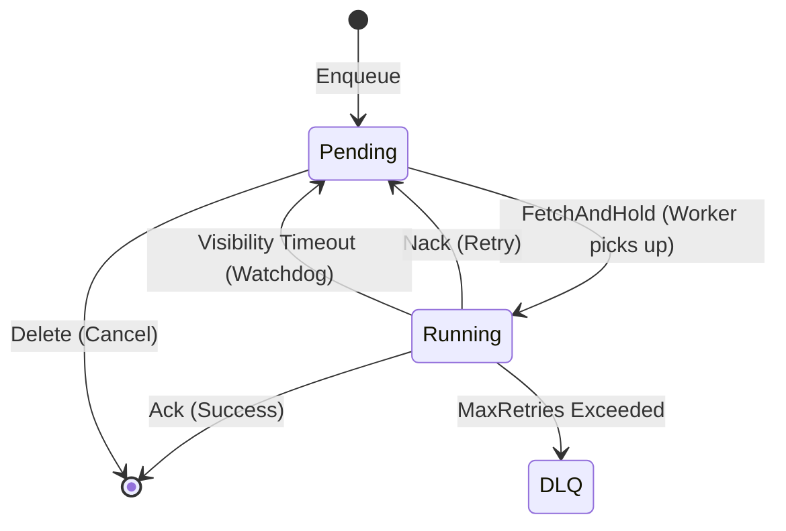

<div align="center">

# Async Task Platform

A lightweight, Redis-backed asynchronous task scheduling platform with gRPC interface.

Designed to evolve from a simple delay queue into a full-featured distributed task scheduler supporting delayed execution, periodic scheduling, and workflow orchestration.

[](https://go.dev/)
[](LICENSE)

</div>

## Why This Project?

Modern distributed systems face common scheduling challenges:

| Business Scenario | Challenge | How This Platform Helps |
|-------------------|-----------|-------------------------|
| **Order Timeout** | Cancel unpaid orders after 30 minutes | Delayed task with precise execution time |
| **Distributed Cron** | Run daily reports without duplicate execution | Leader election + periodic scheduling |
| **User Lifecycle** | Send welcome email 鈫?wait 3 days 鈫?send coupon | Workflow orchestration (planned) |

This platform abstracts these patterns into a **reusable infrastructure layer**, eliminating the need to reinvent scheduling logic for each use case.

## Current Capabilities

### 鉁?Implemented (MVP)
- **Delayed Task Execution**: Submit tasks with `delay_seconds`, executed at precise time
- **Atomic Batch Retrieval**: Lua scripts ensure tasks are fetched exactly once
- **Visibility Timeout**: Tasks held by workers auto-recover if not acknowledged
- **Retry with Dead Letter Queue**: Failed tasks retry up to `max_retries`, then move to DLQ
- **gRPC API**: Strongly-typed contract via Protobuf

### 馃毀 In Progress
- **Delete/Cancel API**: Cancel pending tasks by ID
- **Retrieve via gRPC**: Workers fetch tasks through gRPC instead of direct Redis access

### 馃搵 Planned
- **Periodic Scheduling**: Cron expression support (`0 2 * * *`)
- **Leader Election**: Single scheduler in distributed deployment
- **Observability**: Prometheus metrics, OpenTelemetry tracing
- **Workflow Engine**: DAG-based task orchestration

## Architecture Overview

```
鈹屸攢鈹€鈹€鈹€鈹€鈹€鈹€鈹€鈹€鈹€鈹€鈹€鈹€鈹€鈹€鈹€鈹€鈹€鈹€鈹€鈹€鈹€鈹€鈹€鈹€鈹€鈹€鈹€鈹€鈹€鈹€鈹€鈹€鈹€鈹€鈹€鈹€鈹€鈹€鈹€鈹€鈹€鈹€鈹€鈹€鈹€鈹€鈹€鈹€鈹€鈹€鈹€鈹€鈹€鈹€鈹€鈹€鈹€鈹€鈹€鈹€鈹€鈹€鈹€鈹€鈹?
鈹?                       Async Task Platform                       鈹?
鈹溾攢鈹€鈹€鈹€鈹€鈹€鈹€鈹€鈹€鈹€鈹€鈹€鈹€鈹€鈹€鈹€鈹€鈹€鈹€鈹€鈹€鈹€鈹€鈹€鈹€鈹€鈹€鈹€鈹€鈹€鈹€鈹€鈹€鈹€鈹€鈹€鈹€鈹€鈹€鈹€鈹€鈹€鈹€鈹€鈹€鈹€鈹€鈹€鈹€鈹€鈹€鈹€鈹€鈹€鈹€鈹€鈹€鈹€鈹€鈹€鈹€鈹€鈹€鈹€鈹€鈹?
鈹?                                                                 鈹?
鈹? 鈹屸攢鈹€鈹€鈹€鈹€鈹€鈹€鈹€鈹€鈹€鈹€鈹€鈹€鈹€鈹?    鈹屸攢鈹€鈹€鈹€鈹€鈹€鈹€鈹€鈹€鈹€鈹€鈹€鈹€鈹€鈹?    鈹屸攢鈹€鈹€鈹€鈹€鈹€鈹€鈹€鈹€鈹€鈹€鈹€鈹€鈹€鈹?    鈹?
鈹? 鈹?  Producer   鈹?    鈹?  Scheduler  鈹?    鈹?   Worker    鈹?    鈹?
鈹? 鈹?             鈹?    鈹?             鈹?    鈹?             鈹?    鈹?
鈹? 鈹? Enqueue()   鈹傗攢鈹€鈹€鈹€鈻垛攤  Watchdog    鈹傗攢鈹€鈹€鈹€鈻垛攤 FetchAndHold 鈹?    鈹?
鈹? 鈹?             鈹?    鈹? (Recovery)  鈹?    鈹? Execute()   鈹?    鈹?
鈹? 鈹斺攢鈹€鈹€鈹€鈹€鈹€鈹€鈹€鈹€鈹€鈹€鈹€鈹€鈹€鈹?    鈹斺攢鈹€鈹€鈹€鈹€鈹€鈹€鈹€鈹€鈹€鈹€鈹€鈹€鈹€鈹?    鈹斺攢鈹€鈹€鈹€鈹€鈹€鈹€鈹€鈹€鈹€鈹€鈹€鈹€鈹€鈹?    鈹?
鈹?        鈹?                   鈹?                   鈹?             鈹?
鈹?        鈹斺攢鈹€鈹€鈹€鈹€鈹€鈹€鈹€鈹€鈹€鈹€鈹€鈹€鈹€鈹€鈹€鈹€鈹€鈹€鈹€鈹尖攢鈹€鈹€鈹€鈹€鈹€鈹€鈹€鈹€鈹€鈹€鈹€鈹€鈹€鈹€鈹€鈹€鈹€鈹€鈹€鈹?             鈹?
鈹?                             鈻?                                  鈹?
鈹? 鈹屸攢鈹€鈹€鈹€鈹€鈹€鈹€鈹€鈹€鈹€鈹€鈹€鈹€鈹€鈹€鈹€鈹€鈹€鈹€鈹€鈹€鈹€鈹€鈹€鈹€鈹€鈹€鈹€鈹€鈹€鈹€鈹€鈹€鈹€鈹€鈹€鈹€鈹€鈹€鈹€鈹€鈹€鈹€鈹€鈹€鈹€鈹€鈹€鈹€鈹€鈹€鈹€鈹€鈹€鈹€鈹€鈹€鈹€鈹€鈹? 鈹?
鈹? 鈹?                    Redis (Storage)                        鈹? 鈹?
鈹? 鈹? 鈹屸攢鈹€鈹€鈹€鈹€鈹€鈹€鈹€鈹€鈹€鈹€鈹€鈹€鈹? 鈹屸攢鈹€鈹€鈹€鈹€鈹€鈹€鈹€鈹€鈹€鈹€鈹€鈹€鈹? 鈹屸攢鈹€鈹€鈹€鈹€鈹€鈹€鈹€鈹€鈹€鈹€鈹€鈹€鈹?       鈹? 鈹?
鈹? 鈹? 鈹?ddq:tasks   鈹? 鈹?ddq:running 鈹? 鈹? ddq:dlq    鈹?       鈹? 鈹?
鈹? 鈹? 鈹? (ZSet)     鈹? 鈹?  (Hash)    鈹? 鈹?  (List)    鈹?       鈹? 鈹?
鈹? 鈹? 鈹?Pending     鈹? 鈹?In-Flight   鈹? 鈹?Dead Letter 鈹?       鈹? 鈹?
鈹? 鈹? 鈹斺攢鈹€鈹€鈹€鈹€鈹€鈹€鈹€鈹€鈹€鈹€鈹€鈹€鈹? 鈹斺攢鈹€鈹€鈹€鈹€鈹€鈹€鈹€鈹€鈹€鈹€鈹€鈹€鈹? 鈹斺攢鈹€鈹€鈹€鈹€鈹€鈹€鈹€鈹€鈹€鈹€鈹€鈹€鈹?       鈹? 鈹?
鈹? 鈹斺攢鈹€鈹€鈹€鈹€鈹€鈹€鈹€鈹€鈹€鈹€鈹€鈹€鈹€鈹€鈹€鈹€鈹€鈹€鈹€鈹€鈹€鈹€鈹€鈹€鈹€鈹€鈹€鈹€鈹€鈹€鈹€鈹€鈹€鈹€鈹€鈹€鈹€鈹€鈹€鈹€鈹€鈹€鈹€鈹€鈹€鈹€鈹€鈹€鈹€鈹€鈹€鈹€鈹€鈹€鈹€鈹€鈹€鈹€鈹? 鈹?
鈹?                                                                 鈹?
鈹斺攢鈹€鈹€鈹€鈹€鈹€鈹€鈹€鈹€鈹€鈹€鈹€鈹€鈹€鈹€鈹€鈹€鈹€鈹€鈹€鈹€鈹€鈹€鈹€鈹€鈹€鈹€鈹€鈹€鈹€鈹€鈹€鈹€鈹€鈹€鈹€鈹€鈹€鈹€鈹€鈹€鈹€鈹€鈹€鈹€鈹€鈹€鈹€鈹€鈹€鈹€鈹€鈹€鈹€鈹€鈹€鈹€鈹€鈹€鈹€鈹€鈹€鈹€鈹€鈹€鈹?
```

### Core Components

| Component | Location | Responsibility |
|-----------|----------|----------------|
| **gRPC Server** | `cmd/server/` | Accepts task submissions, exposes scheduling API |
| **Worker** | `cmd/worker/` | Polls for due tasks, executes business logic |
| **Queue Service** | `internal/queue/` | Business logic: validation, ID generation, routing |
| **Watchdog** | `internal/scheduler/` | Recovers tasks stuck in "running" state |
| **Redis Store** | `internal/storage/redis/` | Persistence layer with Lua-based atomic operations |

### Task Lifecycle



## Quick Start

### Prerequisites
- Go 1.21+
- Docker Desktop (for Redis)
- Make (available via Chocolatey: `choco install make`)

### 1. Clone and Configure
```powershell
git clone https://github.com/AkikoAkaki/async-task-platform.git
cd async-task-platform
Copy-Item config/config.example.yaml config/config.yaml
```

### 2. Start Redis
```powershell
make up
```

### 3. Run the Server
```powershell
make run-server
```

### 4. Run a Worker (separate terminal)
```powershell
make run-worker
```

### 5. Submit a Test Task
```powershell
# Using grpcurl (install: go install github.com/fullstorydev/grpcurl/cmd/grpcurl@latest)
grpcurl -plaintext -d '{
  "topic": "order-cancel",
  "payload": "{\"order_id\":1024}",
  "delay_seconds": 10
}' localhost:9090 api.queue.DelayQueueService/Enqueue
```

### 6. Tear Down
```powershell
make down
```

## Project Structure

```
async-task-platform/
鈹溾攢鈹€ api/proto/                    # Protobuf definitions
鈹?  鈹溾攢鈹€ queue.proto               # Service contract
鈹?  鈹溾攢鈹€ queue.pb.go               # Generated Go types
鈹?  鈹斺攢鈹€ queue_grpc.pb.go          # Generated gRPC stubs
鈹?
鈹溾攢鈹€ cmd/                          # Application entry points
鈹?  鈹溾攢鈹€ server/main.go            # gRPC server + Watchdog
鈹?  鈹斺攢鈹€ worker/main.go            # Task consumer
鈹?
鈹溾攢鈹€ internal/                     # Core business logic
鈹?  鈹溾攢鈹€ queue/                    # Service layer (gRPC handlers)
鈹?  鈹溾攢鈹€ scheduler/                # Watchdog (timeout recovery)
鈹?  鈹溾攢鈹€ storage/                  # Storage abstraction
鈹?  鈹?  鈹溾攢鈹€ interface.go          # JobStore interface
鈹?  鈹?  鈹斺攢鈹€ redis/                # Redis implementation
鈹?  鈹?      鈹溾攢鈹€ store.go          # CRUD operations
鈹?  鈹?      鈹斺攢鈹€ script.go         # Lua scripts
鈹?  鈹斺攢鈹€ conf/                     # Configuration loading
鈹?
鈹溾攢鈹€ config/                       # Configuration files
鈹溾攢鈹€ deploy/                       # Docker Compose for Redis
鈹溾攢鈹€ docs/                         # Documentation
鈹?  鈹溾攢鈹€ ARCHITECTURE.md           # System design details
鈹?  鈹溾攢鈹€ API.md                    # gRPC API reference
鈹?  鈹斺攢鈹€ adr/                      # Architecture Decision Records
鈹?
鈹溾攢鈹€ Makefile                      # Build automation
鈹斺攢鈹€ README.md                     # This file
```

## Make Targets

| Command | Description |
|---------|-------------|
| `make up` / `make down` | Start/stop Redis via Docker Compose |
| `make run-server` | Run the gRPC server |
| `make run-worker` | Run the worker process |
| `make proto` | Regenerate Go code from `.proto` files |
| `make test` | Run tests with race detector |
| `make lint` | Run golangci-lint |
| `make fmt` | Format code with goimports |

## Roadmap

### Phase 1: Core Completion (Current)
- [ ] Implement `Delete` API for task cancellation
- [ ] Implement `Retrieve` gRPC endpoint
- [ ] Add idempotency key support

### Phase 2: Distributed Scheduling
- [ ] Cron expression parsing and periodic tasks
- [ ] Leader election for single-scheduler guarantee
- [ ] Topic-based queue sharding

### Phase 3: Production Readiness
- [ ] Prometheus metrics (`/metrics` endpoint)
- [ ] OpenTelemetry tracing
- [ ] Chaos testing with toxiproxy

### Phase 4: Workflow Engine (Future)
- [ ] DAG-based task dependencies
- [ ] Workflow state persistence
- [ ] Visual workflow editor

## Documentation

| Document | Description |
|----------|-------------|
| [ARCHITECTURE.md](docs/ARCHITECTURE.md) | Detailed system design and data flows |
| [API.md](docs/API.md) | gRPC API reference with examples |
| [DEV_SETUP.md](docs/DEV_SETUP.md) | Development environment setup |
| [ADR-001](docs/adr/001-architecture-and-storage.md) | Redis + gRPC decision rationale |
| [ADR-002](docs/adr/002-gitflow-and-versioning.md) | Git workflow and versioning policy |

## Contributing

1. Fork the repository
2. Create a feature branch (`git checkout -b feature/amazing-feature`)
3. Run tests and linting (`make test && make lint`)
4. Commit with conventional messages (`feat: add X`, `fix: resolve Y`)
5. Open a Pull Request

## License

This project is licensed under the MIT License - see the [LICENSE](LICENSE) file for details.


