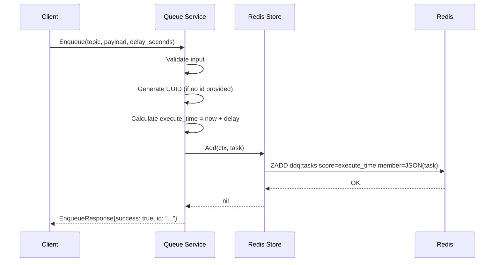
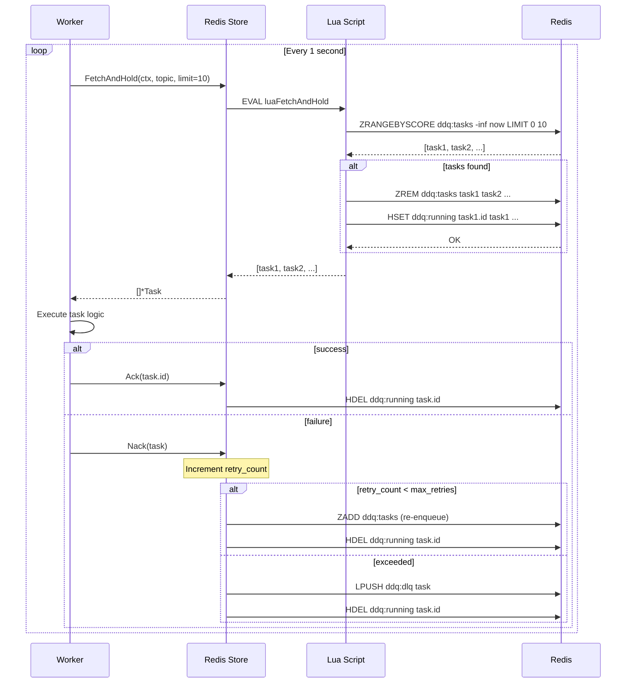
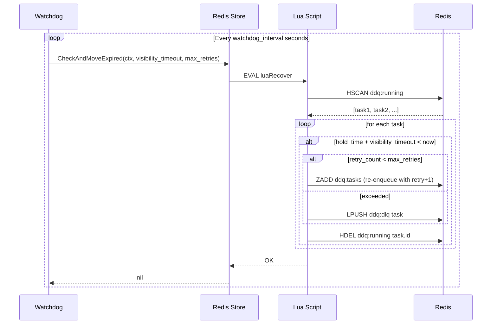

# Architecture Overview

This document describes the architecture of the Async Task Platform—a distributed system designed to handle delayed execution, periodic scheduling, and (in the future) workflow orchestration.

## Design Goals

1. **Reliable Delayed Execution**: Tasks execute at their scheduled time, surviving process crashes and network partitions.
2. **Exactly-Once Semantics**: Each task is delivered to exactly one worker, with automatic recovery for failed executions.
3. **Horizontal Scalability**: Multiple workers can consume tasks in parallel; the scheduler can be scaled with leader election.
4. **Pluggable Storage**: The `JobStore` interface allows swapping Redis for other backends without changing business logic.
5. **Observable Operations**: Integrated metrics and tracing for production debugging.

## System Components

### Component Diagram

```
┌─────────────────────────────────────────────────────────────────────────┐
│                          Async Task Platform                             │
├─────────────────────────────────────────────────────────────────────────┤
│                                                                          │
│  ┌─────────────┐         ┌─────────────┐         ┌─────────────┐        │
│  │  Producer   │         │  Scheduler  │         │   Worker    │        │
│  │  (Client)   │         │  (Server)   │         │  (Consumer) │        │
│  │             │  gRPC   │             │  Poll   │             │        │
│  │  Enqueue ───┼────────▶│  Watchdog   │◀────────┼─ Execute    │        │
│  │  Delete     │         │  Recovery   │         │  Ack/Nack   │        │
│  └─────────────┘         └──────┬──────┘         └──────┬──────┘        │
│                                 │                       │               │
│                                 ▼                       ▼               │
│  ┌───────────────────────────────────────────────────────────────────┐  │
│  │                        Storage Layer                               │  │
│  │  ┌───────────────────────────────────────────────────────────┐    │  │
│  │  │                    JobStore Interface                      │    │  │
│  │  │  Add() | FetchAndHold() | Remove() | Ack() | Nack()       │    │  │
│  │  └───────────────────────────────────────────────────────────┘    │  │
│  │                              │                                     │  │
│  │                              ▼                                     │  │
│  │  ┌───────────────────────────────────────────────────────────┐    │  │
│  │  │                   Redis Implementation                     │    │  │
│  │  │                                                            │    │  │
│  │  │  ddq:tasks (ZSet)    ddq:running (Hash)    ddq:dlq (List) │    │  │
│  │  │  Score: ExecuteTime   Field: TaskID         LPUSH on fail  │    │  │
│  │  │  Member: Task JSON    Value: Task JSON                     │    │  │
│  │  └───────────────────────────────────────────────────────────┘    │  │
│  └───────────────────────────────────────────────────────────────────┘  │
│                                                                          │
└─────────────────────────────────────────────────────────────────────────┘
```

### Component Responsibilities

| Component | Package | Purpose |
|-----------|---------|---------|
| **gRPC Server** | `cmd/server` | Entry point; initializes storage, starts Watchdog, exposes gRPC service |
| **Queue Service** | `internal/queue` | Implements gRPC handlers; validates input, generates IDs, routes to storage |
| **Watchdog** | `internal/scheduler` | Background goroutine; recovers tasks stuck in "running" state |
| **Worker** | `cmd/worker` | Polls `FetchAndHold`; executes task logic; calls Ack/Nack |
| **JobStore** | `internal/storage` | Interface defining storage contract |
| **Redis Store** | `internal/storage/redis` | Concrete implementation using Redis data structures + Lua scripts |

## Data Model

### Task Entity

```protobuf
message Task {
  string id = 1;           // Unique identifier (UUID or client-provided)
  string topic = 2;        // Logical grouping (e.g., "order-cancel")
  string payload = 3;      // Business data (JSON string)
  int64  execute_time = 4; // Unix timestamp for scheduled execution
  int32  retry_count = 5;  // Current retry attempt (starts at 0)
  int32  max_retries = 6;  // Maximum allowed retries before DLQ
  int64  created_at = 7;   // Task creation timestamp
}
```

### Redis Data Layout

| Key | Type | Purpose |
|-----|------|---------|
| `ddq:tasks` | Sorted Set | Pending tasks. Score = `execute_time`, Member = JSON-serialized Task |
| `ddq:running` | Hash | In-flight tasks. Field = `task_id`, Value = JSON Task + hold timestamp |
| `ddq:dlq` | List | Dead Letter Queue. Tasks that exceeded `max_retries` |

## Runtime Flows

### Enqueue Path



### FetchAndHold Path (Worker Consumption)



### Watchdog Recovery

The Watchdog runs periodically (configurable interval) to detect and recover "stuck" tasks:



## Atomicity Guarantees

All critical operations use **Lua scripts** to ensure atomicity:

| Operation | Script | Guarantee |
|-----------|--------|-----------|
| `FetchAndHold` | `luaFetchAndHold` | Tasks are removed from pending and added to running in one atomic operation |
| `Ack` | `luaAck` | Task is removed from running only if it exists |
| `Nack` | `luaNack` | Task is either re-enqueued or moved to DLQ atomically |
| `Recover` | `luaRecover` | Timeout detection and recovery happen without race conditions |

## Scaling Considerations

### Current Limitations (MVP)
- Single Redis instance (no clustering)
- All topics share one ZSet (`ddq:tasks`)
- No leader election—only one scheduler should run

### Future Enhancements
| Enhancement | Benefit |
|-------------|---------|
| **Topic Sharding** | `ddq:tasks:{topic}` reduces lock contention |
| **Redis Cluster** | Horizontal scaling for storage |
| **Leader Election** | Multiple server instances with single active scheduler |
| **Protobuf Serialization** | Reduced memory footprint vs JSON |

## Configuration

Key configuration options in `config/config.yaml`:

```yaml
app:
  name: "async-task-platform"
  env: "local"

server:
  grpc_port: 9090

redis:
  addr: "localhost:6379"

queue:
  visibility_timeout: 30    # Seconds before stuck task is recovered
  watchdog_interval: 10     # Seconds between Watchdog scans
  max_retries: 3            # Default retry limit
```

## Related Documents

- [API.md](API.md) — gRPC API reference and examples
- [DEV_SETUP.md](DEV_SETUP.md) — Development environment setup
- [adr/001-architecture-and-storage.md](adr/001-architecture-and-storage.md) — Why Redis + gRPC
- [adr/002-gitflow-and-versioning.md](adr/002-gitflow-and-versioning.md) — Git workflow and versioning
