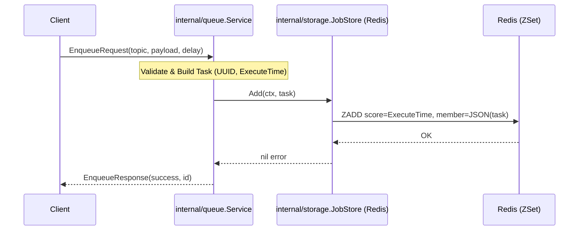
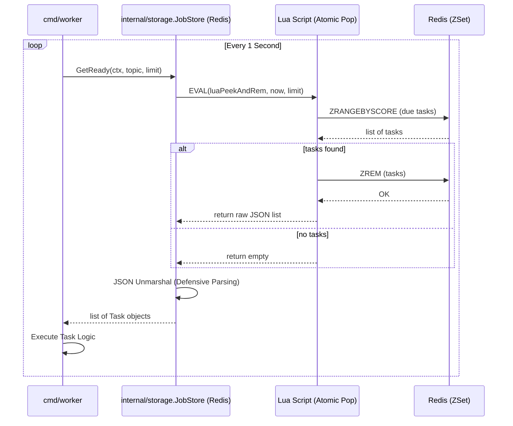

# Architecture Overview

This document describes how the distributed delay queue is structured today and what is planned for the near term.

## Goals
- Accept delayed jobs through a strongly typed API.
- Persist jobs durably so that they survive process crashes.
- Deliver tasks close to their scheduled execution time with horizontal scalability.
- Provide a clear abstraction layer so storage engines can be swapped without touching business logic.

## Component Map
1. **API Server**
   - Exposes the gRPC `DelayQueueService` defined under `api/proto`.
   - Validates client payloads, normalizes timestamps, and calls into domain services.
2. **Scheduler Loop**
   - Runs inside the server process (or a dedicated service in the future).
   - Periodically calls `JobStore.GetReady` to pull due tasks and then publishes them to workers.
3. **Worker Fleet**
   - Polls the `Retrieve` RPC with a configured topic and batch size.
   - Executes tasks and acknowledges completion or calls `Delete` to drop cancelled jobs.
4. **JobStore Implementations**
   - `internal/storage` declares the `JobStore` interface.
   - `internal/storage/redis` implements the interface with a Redis sorted set plus Lua scripts for atomic pop.
5. **External Dependencies**
   - Redis (default namespace `ddq:tasks`).
   - Docker Compose is used to provision Redis for local work.

## Runtime Flows
### Enqueue Path

1. Client sends `EnqueueRequest(topic, payload, delay_seconds, optional id)`.
2. Server converts the delay into an absolute Unix timestamp and builds a `pb.Task`.
3. `JobStore.Add` serializes the task (JSON in the Redis implementation) and adds it to the ZSet with the timestamp score.
4. The scheduler loop eventually observes that the score is less than `now` and makes the task eligible.

### Retrieve Path

1. Worker issues `RetrieveRequest(topic, batch_size)`.
2. Scheduler loop (or the worker itself depending on deployment) calls `JobStore.GetReady` with the same topic and limit.
3. Redis Lua script atomically fetches and removes due members from `ddq:tasks`.
4. Tasks are returned through `RetrieveResponse` and executed by the worker.

### Delete Path
1. Worker or client issues `DeleteRequest(id)` when a task must be cancelled.
2. Future storage implementations will use a secondary index to remove the task by id (the Redis MVP still returns `not implemented`).

## Data Model
- `Task.id`: globally unique identifier, provided by the caller or generated server side.
- `Task.topic`: allows logical isolation of different business streams.
- `Task.payload`: opaque JSON string interpreted by downstream workers.
- `Task.execute_time`: Unix timestamp (seconds) that determines ordering inside the JobStore.

## Redis Layout
- **Key**: `ddq:tasks` (can be namespaced later per tenant/topic).
- **Score**: execution timestamp.
- **Member**: serialized `Task` JSON blob.
- **Lua Script**: `internal/storage/redis/script.go` atomically performs `ZRANGEBYSCORE` + `ZREM` to avoid duplicate delivery.

## Scaling Considerations
- Introduce sharded keys such as `ddq:tasks:{topic}` to reduce contention.
- Replace JSON serialization with Protobuf to shrink memory footprint.
- Build a `Remove` implementation backed by an id->payload hash map.
- Move the scheduler loop into its own service so multiple API replicas can share the same Redis cluster.

## Related Documents
- `docs/DEV_SETUP.md` explains how to bootstrap the development environment.
- `docs/API.md` details each RPC in `DelayQueueService`.
- `docs/adr/001-architecture-and-storage.md` records the rationale behind using Redis + gRPC for the MVP.
